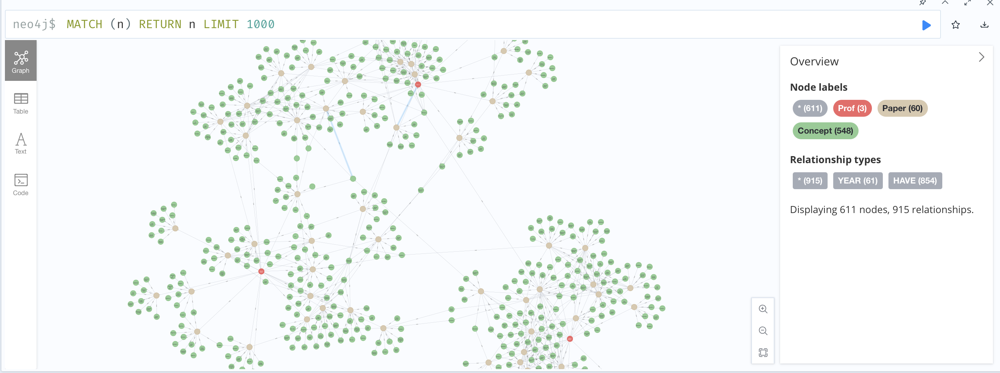
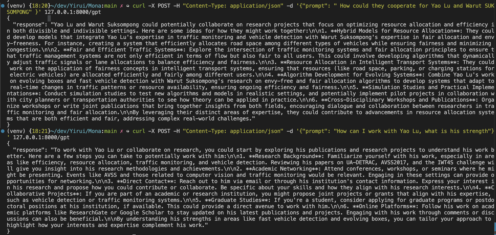

## Overview
This project builds a knowledge graph using Google Scholar profile of NUS SOC professors. 


## outcome


[Neo4J Address](127.0.0.1:7474)

## Test Example

```sh
curl -X POST -H "Content-Type: application/json" -d '{"prompt": " How could they cooperate for Yao Lu and Warut SUKSOMPONG" }' 127.0.0.1:8000/gpt
```

## Prerequisites
- Docker
- Docker Compose

## Getting Started
1. Clone the repository:
    ```sh
    git clone https://github.com/mikelovato/Mona.git
    cd Mona
    ```

2. Run the project with Docker Compose:
    ```sh
    docker-compose up --build
    ```

## Testing
Each file can be tested by running the main function. For example:
```sh
python path/to/your_script.py
```

## License
This project is licensed under the MIT License.
